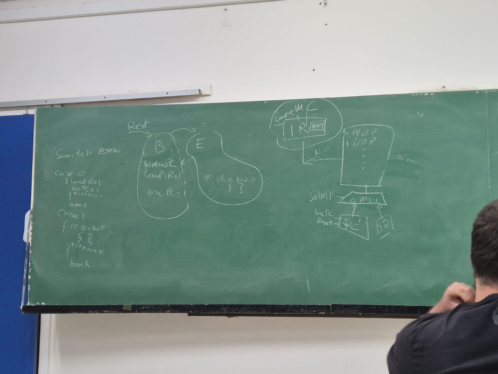

# SSC0513 - Organização e Arquitetura de Computadores

## Bibliografia: 
Livro Texto PATTERSON, D. A., HENNESSY, J.L. Computer Organization and Design, Fifth Edition: The Hardware/Software Interface. Morgan Kaufmann Publishers, 2013. Bibliografia Complementar PATTERSON, D. A., HENNESSY, J.L. Computer Organization and Design RISC-V Edition: The Hardware Software Interface. Morgan Kaufmann Publishers, 2020. PATTERSON, D. A., HENNESSY, J.L. Computer Organization and Design Arm Edition: The Hardware Software Interface. Morgan Kaufmann Publishers, 2016. STALLINGS, W. Computer Organization and Architecture: designing for performance. 10th Edition, Pearson Education, 2015. TANENBAUM, A.S. Structured Computer Organization. 6th Edition. Pearson Education, 2012.

##  Prova

### Possiveis questões da prova:

* Desenhe uma maquina mínima capaz de armazenar o prog e executar ele sendo a unica operação é a **nop (no operation)** e implemente a **maquina de controle** disso, que seria as maquinas de estados. switch dos estados; case 0 = busca, case 1 = executa.

* * Resposta:

* * 

* Diferença de risc e cisc:

* * Resposta:
* * 

