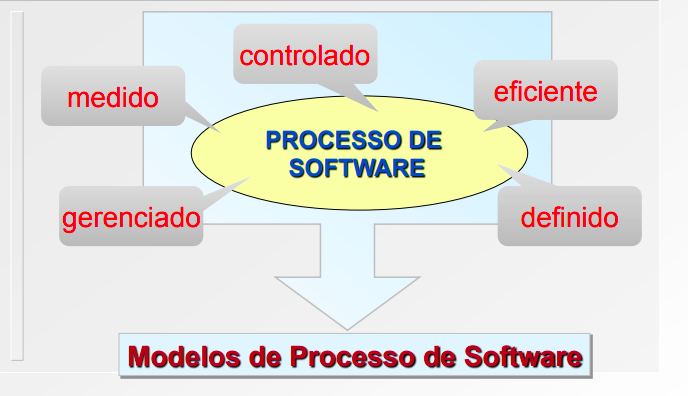
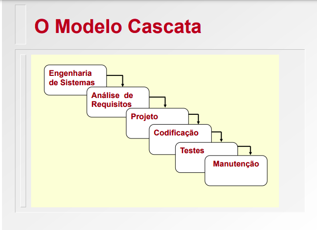
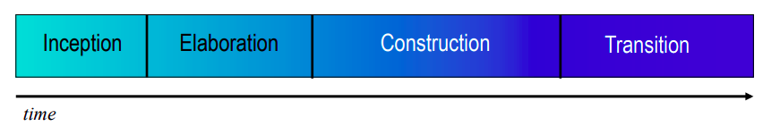
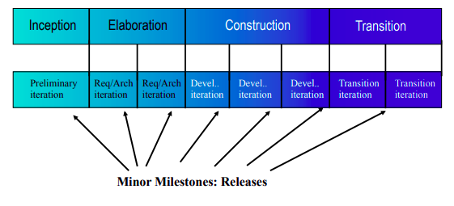
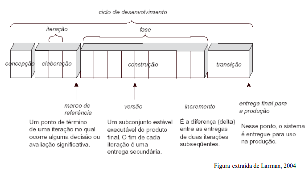
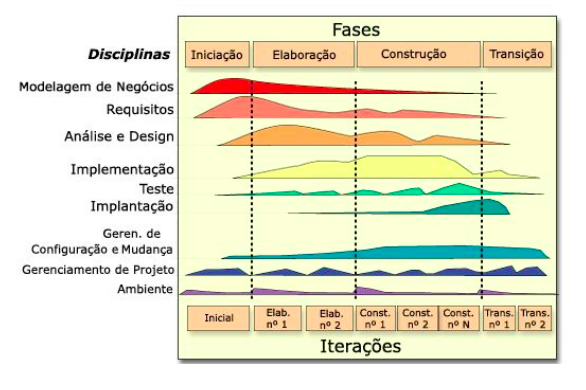
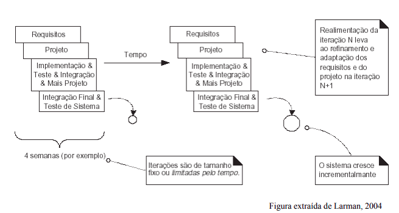
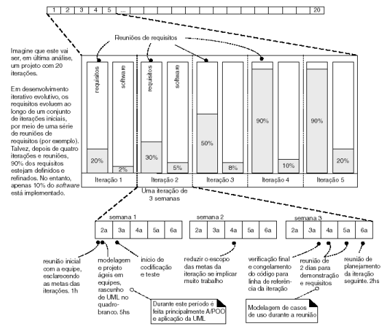
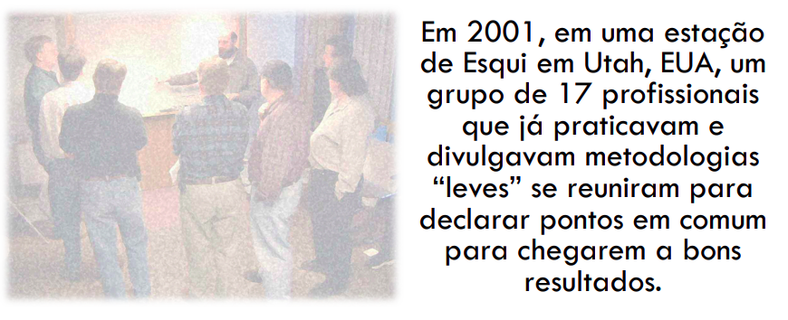

# Aula 1
## Apresentação da disciplina
# Aula 2
## Engenharia de software 
# Aula 3
## Qualidade de processo
# Aula 4
## Modelos de Processo de software
#### Fases Genéricas:
- Definição: Análise de Sistema; Planejamento do Projeto; Análise de Requisitos.
- Construção: Projeto; Codificação; Teste.
- **Software Produto construido.**
- Manutenção: Entendimento; Modificação; Revalidação.

 Existem **vários** modelos de processo de software e esse é um dos paradigmas da Engenharia de software. Os processos tem que ser Genéricos, Abstratos do processo, ou seja, usados em diferentes contextos e para explicar diferentes abordagens para o desenvolvimento de software.

### Modelo Cascata:
- Modelo mais antigo e mais amplamente utilizado.
- - Paradigma do ciclo da Vida Clássico.
- - Modelo Sequencial Linear.
- Sugere uma abordagem **sistemática sequencial** para o desenvolvimento de software

- **Engenharia de sistema:** Estabelecimento de requisitos para **todos os elementos do sistema** e atribuição de um subconjunto desses requisitos para o software.
- - Visão essencial quando o software deve fazer interface com outros elemento (hardware, pessoas, banco de dados, etc.). 

- **Análise de Requisitos de Software:** O processo de coleta dos requisitos é intensificado e concentrado especificamente no software. Os requisitos (do sistema e do software) devem ser revisados e documentados com o cliente
- - Deve-se compreender o **dominio da informação** do sistema, a **função**, o **desempenho** e a **interface exigida.**

- **Projeto:** Tradução dos requisitos de software para um conjunto de representações que podem ser avaliadas quanto à qualidade, antes que a condição se inicie, concentra alguns aspectos distintos do programa.
- - **interface.**
- - **arquitetura de software.** 
- - **estrutura de dados.**
- - **detalhes procedimentais.**

- **Codificação:** Tradução da representação do projeto para uma linguagem de programação.

- **Testes:** Concentram-se nos aspectos **logicos internos** do software, garantindo que todas as instruções sejam executadas corretamente. Concentram-se nos **aspectos funcionais externos** a fim de descobrir erros e garantir que as entradas definidas produzam resultados reais que estejam em conformidade com os resultados esperados.

- **Manutenção:** Provavelmente o software sofrerá mudanças depois de ser entregue ao cliente. Causas para as mudanças:
- - **Erros**
- - Adaptação do software para **acomodar** mudanças em seu ambiente externo.
- - Exigência do cliente para **melhorar** funções e desempenho do software.
- - Reaplica cada uma das fases.

# Aula 5
## Processo Unificado (PU)
É um modelo de processo de software baseado no modelo incremental e iterativo, visando a construção de software orientado a objeto. Usa como notação de apoio o **UML**(Unified Modeling Language)
* O **Processo Unificado** é uma estrutura de processo de desenvolvimento de software que pode ser especializado para:
* * diferentes classes de sistemas de software.
* * diferentes áreas de aplicação.
* * diferentes tipos de organização.
* * diferentes níveis de competências.
* * diferentes portes de sistema.

* É **iterativo e incremental:** o produto é desenvolvido por partes, de modo a acrescentar requisitos de forma controlada.
* é baseado em **casos de uso:** os casos de uso direcionam as atividades de desenvolvimento.
* É centrado em arquitetura: a arquitetura é
estabelecida no início do desenvolvimento e
refinada ao longo das atividades. 

#### O PU é iterativo e incremental
* O ciclo de fases é divida em **fases.**
 

* * **Concepção** (define o escopo do projeto)
* * **Elaboração** (define os requisitos e a arquitetura)
* * **Construção** (desenvolve o sistema)
* * **Transição** (implanta o sistema)

* Cada fase é divida em **iterações.**

* Cada iteração
* * É **planejada.**
* * Realiza uma **sequência de atividades distintas.**
* * * Elicitação de requisitos, análise e projeto,
implementação, testes, etc.
* * **Integra artefatos produzidos** com artefatos já
existentes.
* * Resulta em uma **versão executável** do sistema.
* * É avaliada segundo **critérios de sucesso**
previamente definidos.

* Planejar quantos ciclos de desenvolvimento serão
necessários para alcançar os objetivos do sistema.
* As partes mais importantes devem ser priorizadas
e alocadas nos primeiros ciclos.
* * A primeira iteração deve estabelecer os principais
riscos e o escopo inicial do projeto, de acordo com a
funcionalidade principal do sistema.
* * Partes mais complexas do sistema devem ser
consideradas já no primeiro ciclo, pois são elas que
apresentam maior risco de inviabilizar o projeto. 
* O **tamanho de cada ciclo** pode variar de uma
empresa para outra e conforme o tamanho do
sistema.
* * Uma empresa pode desejar ciclos de 4 semanas, outra
pode preferir 3 meses.
* Produtos entregues em um ciclo **podem ser
colocados imediatamente em operação**, mas
**podem vir a ser substituídos por outros produtos
mais completos** em ciclos posteriores.
* Os casos de uso **não servem apenas** para
definir os **requisitos do sistema**!!
* Várias atividades são guiadas pelos casos de
uso:
* * **Planejamento** das iterações.
* * **Criação e validação** do modelo de projeto.
* * **Planejamento** da integração do sistema.
* * **Definição** dos casos de teste.

# Aula 6

## Desenvolvimento Ágil
### Motivação
Quais são os problemas normalmente encontrados em processo de desenvolvimento tradicional?  
* Escopo
* Estimativa
* Esforço
* Mudança
* Adequação a necessidade do cliente 
* Visualização tardia
* Envolvimento do cliente 
* Aceite

### O que é "Agilidade"?
* **Agilidade**
* * Rapidez, Desembaraço
* * Qualidade de quem é veloz
* **Capacidade de responder rapidamente a mudanças.** 
* * Mudanças de tecnologias, de equipe, de requisitos
* **Entregar valor ao cliente quando se lida com imprevisibilidade e dinamismo dos projetos.**

### Manifesto Ágil

* **Estamos descobrindo melhores formas de desenvolver software através da nossa própria prática e auxiliando outros.**

#### 4 Valores do Manifesto Ágil

| Valores                          | Ágil                    | Tradicional                    |
|-----------------------------------|-------------------------|--------------------------------|
| Interação entre **indivíduos         |** mais do que             | Processos e ferramentas        |
| Produto funcionando                | mais do que             | Documentação extensa           |
| Colaboração com o cliente          | mais do que             | Termos negociados (contrato)   |
| Resposta às mudanças               | mais do que             | Cumprimento de planos          |

#### 12 Princípios da Agilidade
1. A mais alta prioridade é **satisfazer o cliente**, por meio da **liberação rápida** e contínua de software de valor.
2. **Receba bem as mudanças de requisitos**, mesmo em estágios tardios de desenvolvimento. Processos ágeis devem admitir mudanças que trazem vantagens competitivas para o cliente.
3. **Liberar software frequentemente**, em intervalos de 2 semanas até meses, dando preferência ao menor tempo entre releases.
4. Manter pessoas ligadas ao **negócio e desenvolvedores trabalhando juntos** o maior parte do tempo do projeto.
5. Construa projetos com **indivíduos motivados**, dê a eles o ambiente e o suporte que precisam e confie neles para fazer o trabalho realizado.
6. O método mais eficiente e eficaz de repassar informações entre equipe de desenvolvimento é pela **comunicação face a face.**
7. O **software funcionando** é a principal medida de **progresso em um projeto** de software.
8. Os processos ágeis promovem o desenvolvimento sustentável. Assim, patrocinadores, desenvolvedores e usuários **devem ser capazes de manter convergência contínua indefinidamente**.
9. A atenção contínua para a **excelência técnica e um bom projeto (design) aprimora a agilidade**.
10. **Simplicidade** (ou seja, o máximo de trabalho não executado) é essencial.
11. As melhores arquiteturas, requisitos e designs emergem de **equipes auto-organizadas.**
12. Em intervalos regulares, **a equipe reflete sobre como se tornar mais eficaz**, e então ajustam e aperfeiçoam seu comportamento de acordo.

#### Objetivo
satisfazer o cliente entregando, rapidamente e com frequência, sistemas com algum valor.

* Entregar versões funcionais em prazos curtos.
* Estar preparado para requisitos mutantes. 
* Pessoal de negócios e desenvolvedores juntos. 
* Troca de informações por meio de conversas diretas.  

