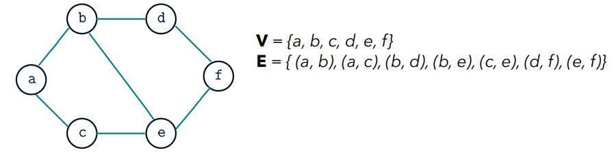
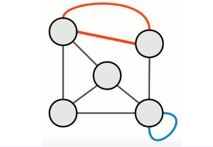
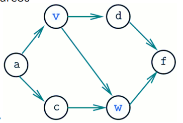
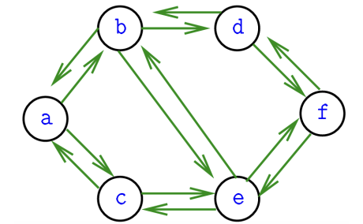
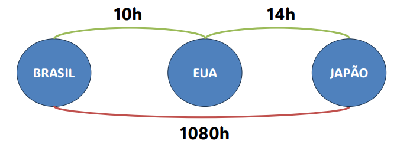
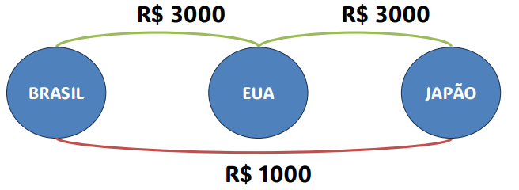

# Caderno de anotações 
# Sumário
- [Cálculo Numérico](#cálculo-numérico)
    - [Introdução](#introdução-cn)
- [Sistemas Operacionais I](#sistemas-operacionais-i)
    - [Introdução](#introdução-so)

- [Programação Orientada a Objetos](#programação-orientada-a-objetos)
- [Algoritmo e Estrutura de Dados II](#algoritmo-e-estrutura-de-dados-ii)
- [Requisitos de Software](#requisitos-de-software)
- [Introdução a Estatística](#introdução-a-estatística)
- [Programação Funcional](#programação-funcional)
    - [Aula 1](#aula-1)
    - [Aula 2](#aula-2)
      - [Introdução](#introdução-hs)
      - [Funções](#funções-em-haskell)
      - [Listas](#listas-em-haskell)

---

# Cálculo Numérico
## Introdução CN.
- Bibliografia
    - Livro texto: **Cálculo Científico com MATLAB e Octave, Alfio Quarteroni e Fausto Saleri**
    - Complementares: 
        - Slides do Afonso Paiva Neto (link)
        - o resto era livro em ingles 
- Programa Resumido:
    - Programação, Introdução a Python e Numpy
    - Resolução de sistemas lineares
    - Interpolação


- **Primeira tarefa:** Redija uma opinião sobre o conteúdo da disciplina e sobre o planejamento proposto.
    - Considere o conteúdo adequado, no contexto, de seus objetivos profissionais
    - se tivesse que acrescentar um tópico, qual seria?
    - se tivesse que tirar um tópico, qual seria?
    - quais são, atualmente, os algoritmos de ciência de dados que você gostaria de compreender com maior profundidade? Porquê?
    - **Entrega:** Pelo edisciplinas


# Sistemas Operacionais I
## Introdução SO.
- Bibliografia
    - Livro texto: **Sistemas Operacionais Modernos, TANENBAUM**
- Programa Resumido:

    - Processos
    
      - Definição
      - Tipos de Processos
      - Diagrama de Estados
      - Escalonamento de CPU
      - Comunicação entre Processos
      - Sincronização entre Processos
      - Regiões Críticas
      - Threads
      - Deadlocks
    
    - Gerência de Memória
    
      - Compiladores, Linkers, Loaders e Relocadores
      - Alocação Contígua Simples
      - Alocação Particionada Estática e Dinâmica
      - Swapping
      - Memória Virtual: Paginação e Segmentação
    
    - Entrada/Saída
    
      - Princípios de Hardware e Software
      - Controladores de Dispositivos e Dispositivos de E/S
      - Interrupções
      - Estrutura do Software Gerenciador de E/S
    
    - Sistemas de Arquivos
    
      - Gerência de Espaço em Disco
      - Tipos de Estruturas de Sistemas de Arquivos
      - Tipos de Arquivos, Nomes e Estrutura Interna
      - Exemplos de Sistemas de Arquivos
    - Segurança
      - Criptografia
      - Autenticação
      - Ataques
    - Projeto de Sistemas Operacionais
    - Avaliação de Desempenho de Sistemas Computacionais
    - Exemplos de Sistemas Operacionais
    
      - Windows
      - Linux
      - Android / Symbian / iOS


## Aula 1
**Escrito no tableto**
pdf

## Aula 2

### **Principais Conceitos:**
- **Processo:**
    - **chave** do SO
    - Caracterizado por programas em execução
    - Cada processo possui:
      - Um espaço de endereço;
      - Uma lista de alocação de memória (mínima, máximo);
      - Um conjunto de registradores (contador de programa);
    - O SO controla **todos** os processos

  -  **Estados Básicos dos Processos**
      - **Executando:** 
        - O processo está atualmente em execução na CPU.
        - Está utilizando os recursos do processador para realizar suas tarefas.
        - Pode ser interrompido pelo sistema operacional para dar lugar a outro processo.

      - **Bloqueado:** 
        - O processo está esperando por um evento externo, como uma operação de entrada/saída (E/S) ser concluída.
        - Não pode continuar a execução até que o evento pelo qual está esperando ocorra.
        - **Exemplo:**
     Quando o SO suspende um processo P1 temporariamente
     para executar um processo P2, o processo P1 deve ser
     reiniciado exatamente no mesmo estado no qual estava 
     ao
     ser suspenso. Para tanto, todas as informações a 
     respeito do
     processo P1 são armazenadas em uma tabela de 
     processos (process table). Essa tabela é um vetor ou 
     uma lista encadeada de estruturas.

      - **Pronto:** 
        - O processo está na fila de prontos, aguardando para ser executado pela CPU.
        - Já passou pela fase de inicialização e está pronto para ser executado assim que o processador estiver disponível.
        - Pode ser selecionado pelo escalonador de processos para execução a qualquer momento.
  - Um processo pode resultar na execução de outros processos, chamados processos-filhos:
    - Características de hierarquia de processos
      - Comunicação (interação) e Sincronização;
      - Segurança e Proteção;
  - Escalonadores de processos: processo que escolhe qual será o próximo processo a ser executado;
    - Diversas técnicas para o escalonamento de processos.
  - Comunicação e sincronismo entre processos – solução:
    - Semáforos;
    - Monitores;
    - Instruções especiais em hardware;
    - Troca de mensagens;
  

- **Memória:**
- **Chamadas ao Sistema:**


# Programação Orientada a Objetos

## Aula 1

### Introdução a java
1. Orientação a objetos: Java é totalmente orientada a objetos, o que significa que toda lógica é organizada ao redor de objetos que interagem entre si.
2. Portabilidade: usando o JVM (java virtual machine) permite que execute o codigo de java independente do SO

### Estrutura básica

```java
public class PrimeiroPrograma{

    public static void main(String[] args) {
        System.out.println("Hello World");
    }
}
```

- Todo programa java é contido em uma classe. Ex: classe `PrimeiroPrograma`
- `System.out.println` é o `print`

### Introdução a POO
A Programação Orientada a Objetos (POO) é um paradigma de programação que representa conceitos através de "objetos" que possuem dados (atributos) e funcionalidades (métodos). A POO facilita o gerenciamento de programas complexos ao dividir o código em componentes reutilizáveis, bem definidos e interconectados.

##### Conceito básicos:

1. **Classe:**
Representa um modelo ou molde que define o comportamento e as características comuns a um grupo de objetos.
```java
public class pessoa {

    // atributos (propriedades)
    String nome;
    int idade;

    // método construtor
    public pessoa(String nome, int idade) {
        this.nome = nome;
        this.idade = idade;
    } 
    
    // método

    public void apresentar(){
        System.out.println("Olá, eu sou " + nome + " e tenho " + idade + " anos.");
    }
}
```

2. **Objeto:**
é uma instancia completa da classe, por ex na main:

```java
public class main {
    public static void main(String[] args) {
        pessoa p1 = new pessoa("João", 20);
        p1.apresentar(); // Olá, eu sou João e tenho 20 anos.
    }   
}
```
# Algoritmo e Estrutura de Dados II

## Aula 1
### Introdução a Grafos
#### O que são Grafos?

Grafos são estruturas matemáticas usadas para modelar relações entre objetos. Um grafo é composto por:
- **Vértices (ou nós):** Representam os objetos.
- **Arestas (ou arcos):** Representam as conexões ou relações entre os objetos.

#### Exemplo de Grafo:

```plaintext
  A -- B
  |    |
  C -- D
```

Neste exemplo, `A`, `B`, `C` e `D` são vértices, e as linhas que os conectam são arestas.

#### Grafos:

- **Definições:** Um grafo G = ( V, E ) é composto de:
  - V: conjunto de vértices
  - E: conjunto de arestas (edges)
  - Se α={v, w} é uma aresta de um grafo, dizemos que α liga os vértices v e w, ou que incide em v (e em w).

  

  - **Vértices adjacentes:** vértices conectados por uma aresta.
  - **Grau de um vértice:** número de arestas incidentes.
    - **Exemplo:** na imagem acima temos:
      - a é adjacentes de b
      - a é adjacentes de c
      - o grau de a é 2
  - **Loop:** quando uma aresta conecta um vértice a ele mesmo (azul)
  - **Arestas multiplas:** quando há mais de uma aresta ligando os mesmos vertices (laranja)
    

- **Tipos de grafos:**
  - **Simples**: grafo sem laços nem arestas múltiplas.
  - **Vazio**: um grafo G é vazio se V(G) = E(G) = ∅.
  - **Trivial**: um grafo com apenas um vértice e nenhuma aresta.
  - **Completo**: grafo simples em que qualquer dois de seus vértices distintos são adjacentes.
    - Existe um único grafo completo com n vértices, denotado Kn. O grafo K3 é também chamado de triângulo.


- **Grafo Direcionado (ou Dígrafo):** é um conjunto de vértices e um conjunto de arcos
  - Um dígrafo D = (V, A) é composto de:
    - V: conjunto de vertíces;
    - A: conjunto de arestas;

  

  - **Arco:** é um par ordenado de vértices, ex: v e w são vértices (nós) e v-w é um arco (conexão)
  - O dígrafo pode ser escrito pela sua lista de arcos 
    - **Exemplo:** a-v, a-c, v-w, v-d, w-v, w-f, d-f, c-w
  - A **presença** de um arco v-w é **independente** da existência de w-v.
  - Dizemos que o vértice w é vizinho de um vértice v, que w é adjacente a v, ou ainda que v domina w
  - Dois arcos são **antiparalelos** se a ponta inicial de um é a ponta final do outro
  - O **grau de entrada** de um vértice v é o número de arcos com ponta final v
  - O **grau de saída** de um vértice v é o número de arcos com ponta inicial v
    - **Exemplo:** V tem grau de entrada 1 e grau de saída 2
- **Dígrafo Simetrico:** ▪ Um dígrafo é simétrico se cada um de seus arcos é antiparalelo a outro
  


- **Grafo Ponderado:** As arestas têm pesos associados, representando, por exemplo, custos ou distâncias.

#### Grafos podem ser representações de problemas
**Exemplo 1:**
Uma pessoa que sai em uma viagem geralmente quer saber
qual o caminho mais curto ou qual o caminho mais barato
para ir de uma cidade a outra.



**Exemplo 2:**
Uma pessoa que sai em uma viagem geralmente quer saber
qual o caminho mais curto ou qual o caminho mais barato
para ir de uma cidade a outra.



- Na Web, documentos fazem referências a outros documentos
por meio de links
- A Web é um grafo: os nós são documentos e as conexões são
os links
- Algoritmos baseados em grafos são essenciais para motores
de busca e problemas de recomendação, por exemplo.

# Requisitos de Software
Conteúdo sobre Requisitos de Software.

# Introdução a Estatística
Conteúdo sobre Introdução a Estatística.

# Programação Funcional

## Aula 1

## Aula 2

### Introdução HS
1. Instalar o GHCup
2. Criar o hello world em haskell (o arquivo deve ser .hs)
    - Utilizar o "runhaskell <nome_arquivo>", ele compila, gera o executavel, executa ele e apaga

- **Hello world**
```haskell
-- monad
main = do
  putStrLn "Hello world!!"
  putStrLn (show x)

y = x+1
x = 5
p = show y

```

- função `show`:
  -  converte valores em string, mas não imprime eles
  - por ex: no código acima ele transforma o y em string e guarda ele em p
  - tambem existe o "show de show", por ex:
  ```haskell
  main = do
    PutStrLn (show p) -- imprimirá "8", ou seja, string da string de 8

  y = 8
  p = show y
  ```
- a ordem não importa em haskell, mas é bom manter por conveniencia 
- **NÃO** pode conter multiplas declarações para a mesma variavel
- cuidado com loops
  - se uma variavel usa ela mesma para o cálculo, o haskell calcula infinitamente, por ex:
  ```haskell
  main = do
    putStrLn (show x)
  x = x + 1 -- dessa forma o programa iria ficar em um loop eterno tentando calcular o x
  
  ```

- utilização de valores booleanos

```haskell
main = do 
  putStrLn (show (f True)) -- 5
  putStrLn (show (f False)) -- 42

f True = 5
f False = 42
```

- haskell (ou seus programadores) **ODEIAM** parentesês !!
  - ao invez de usar o () em tudo que for fazer, podemos usar a função "$", da forma apresentada abaixo

```haskell
main = do
    putStrLn  "Hello world!!!"
    putStrLn (show y) -- 8
    putStrLn (show p) -- "8"
    --putStrLn (show w) -- loop
    putStrLn (show (f True)) -- 5
    putStrLn (show (f ( y > 10 ))) -- 42
    putStrLn $ show $ f $ y > 10
```

### **Funções em Haskell**

#### **Definição de Funções**

Em Haskell, as funções são definidas usando a seguinte sintaxe:

```haskell
<nome_da_funcao> <parametro> = <corpo_da_funcao>
```

A chamada de funções em Haskell é feita de forma direta, sem necessidade de parênteses ou operadores especiais. Veja um exemplo simples:

```haskell
main = do
    putStrLn $ show $ g 10 -- Saída: 11

g h = h + 1 -- Função que incrementa o valor recebido em 1
```

Aqui:
- `g` é uma função que recebe um argumento `h` e retorna `h + 1`.
- `putStrLn` imprime a saída no terminal.
- `show` converte o resultado da função `g 10` em uma string para ser impresso.
- O operador `$` evita o uso excessivo de parênteses.

### **Recursão em Haskell**

Em Haskell, funções podem ser **recursivas**, ou seja, chamar a si mesmas. Isso permite a implementação de algoritmos como o **cálculo do fatorial**:

```haskell
main = do
  putStrLn $ show $ fat 5 -- 120

fat 0 = 1
fat n = n * fat (n - 1)
```

Explicação:
- Se `n` for `0`, o fatorial retorna `1` (caso base).
- Caso contrário, multiplicamos `n` pelo fatorial de `n - 1`, até atingir `0`.

### **Listas em Haskell**

As listas são uma estrutura de dados fundamental em Haskell. Elas são representadas por colchetes (`[]`) e podem conter elementos do mesmo tipo.

#### **Exemplo de lista:**
```haskell
numeros :: [Int]
numeros = [1, 2, 3, 4, 5]
```

#### **Operações básicas com listas**

- **Concatenação (`++`)**
```haskell
lista1 = [1, 2, 3]
lista2 = [4, 5]
resultado = lista1 ++ lista2 -- [1, 2, 3, 4, 5]
```

- **Adição de elemento no início (`:`)**
```haskell
novoLista = 0 : numeros -- [0, 1, 2, 3, 4, 5]
```

- **Acessando elementos**
```haskell
primeiro = head numeros -- 1
resto = tail numeros -- [2, 3, 4, 5]
ultimo = last numeros -- 5
```

- **Comprimento da lista**
```haskell
tamanho = length numeros -- 5
```

- **Verificando se a lista está vazia**
```haskell
estaVazia = null numeros -- False
```

- **Mapeamento sobre listas (`map`)**
```haskell
dobro = map (*2) numeros -- [2, 4, 6, 8, 10]
```

- **Filtragem de listas (`filter`)**
```haskell
pares = filter even numeros -- [2, 4]
```

- A lista **tem que ter** um tipo, por ex:

```haskell
o4 = [4, False, "oi"] -- essa lista não funciona, pois ela não possui um tipo
```


- Calculando o tamanho de uma lista com uma função recursiva:
  ```haskell
  r [] = 0
  r (x:xs) = 1 + r xs
  ```
  - **1️⃣ Caso Base**
  ```haskell
  r [] = 0
  ```
  Se a lista for **vazia (`[]`)**, o tamanho dela é **zero**.

  - **2️⃣ Caso Recursivo**
  ```haskell
  r (x:xs) = 1 + r xs
  ```
  Se a lista **não** estiver vazia, significa que tem pelo menos um elemento (`x`) e um restante (`xs`).

  - O `x` (primeiro elemento) não é usado diretamente, apenas conta como um elemento da lista.
  - Chamamos `r xs` para calcular o tamanho do restante da lista (`xs`).
  - Como `x` é um elemento válido, somamos `1` ao resultado da chamada recursiva.

  ```haskell
  r [3, 7, 2]
  = 1 + r [7, 2]
  = 1 + (1 + r [2])
  = 1 + (1 + (1 + r []))
  = 1 + (1 + (1 + 0))
  = 3
  ```

  A lista `[3, 7, 2]` tem **3 elementos**, e a função retorna `3`.


