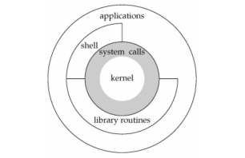
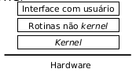
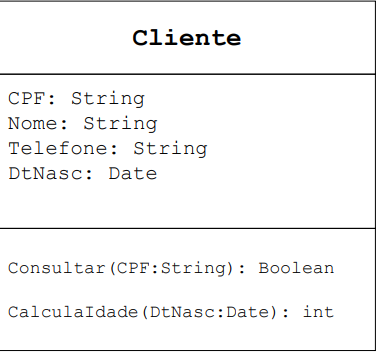

# Caderno de anotações 
# Sumário
- [Cálculo Numérico](#cálculo-numérico)
    - [Introdução](#introdução-cn)
- [Sistemas Operacionais I](#sistemas-operacionais-i)
    - [Introdução](#introdução-so)

- [Programação Orientada a Objetos](#programação-orientada-a-objetos)
- [Algoritmo e Estrutura de Dados II](#algoritmo-e-estrutura-de-dados-ii)
- [Requisitos de Software](#requisitos-de-software)
- [Introdução a Estatística](#introdução-a-estatística)
- [Programação Funcional](#programação-funcional)
    - [Aula 1](#aula-1)
    - [Aula 2](#aula-2)
      - [Introdução](#introdução-hs)
      - [Funções](#funções-em-haskell)
      - [Listas](#listas-em-haskell)

---

# Cálculo Numérico
## Introdução CN.
- Bibliografia
    - Livro texto: **Cálculo Científico com MATLAB e Octave, Alfio Quarteroni e Fausto Saleri**
    - Complementares: 
        - Slides do Afonso Paiva Neto (link)
        - o resto era livro em ingles 
- Programa Resumido:
    - Programação, Introdução a Python e Numpy
    - Resolução de sistemas lineares
    - Interpolação


- **Primeira tarefa:** Redija uma opinião sobre o conteúdo da disciplina e sobre o planejamento proposto.
    - Considere o conteúdo adequado, no contexto, de seus objetivos profissionais
    - se tivesse que acrescentar um tópico, qual seria?
    - se tivesse que tirar um tópico, qual seria?
    - quais são, atualmente, os algoritmos de ciência de dados que você gostaria de compreender com maior profundidade? Porquê?
    - **Entrega:** Pelo edisciplinas


# Sistemas Operacionais I
## Introdução SO.
- Bibliografia
    - Livro texto: **Sistemas Operacionais Modernos, TANENBAUM**
- Programa Resumido:

    - Processos
    
      - Definição
      - Tipos de Processos
      - Diagrama de Estados
      - Escalonamento de CPU
      - Comunicação entre Processos
      - Sincronização entre Processos
      - Regiões Críticas
      - Threads
      - Deadlocks
    
    - Gerência de Memória
    
      - Compiladores, Linkers, Loaders e Relocadores
      - Alocação Contígua Simples
      - Alocação Particionada Estática e Dinâmica
      - Swapping
      - Memória Virtual: Paginação e Segmentação
    
    - Entrada/Saída
    
      - Princípios de Hardware e Software
      - Controladores de Dispositivos e Dispositivos de E/S
      - Interrupções
      - Estrutura do Software Gerenciador de E/S
    
    - Sistemas de Arquivos
    
      - Gerência de Espaço em Disco
      - Tipos de Estruturas de Sistemas de Arquivos
      - Tipos de Arquivos, Nomes e Estrutura Interna
      - Exemplos de Sistemas de Arquivos
    - Segurança
      - Criptografia
      - Autenticação
      - Ataques
    - Projeto de Sistemas Operacionais
    - Avaliação de Desempenho de Sistemas Computacionais
    - Exemplos de Sistemas Operacionais
    
      - Windows
      - Linux
      - Android / Symbian / iOS


## Aula 1
**Escrito no tableto**
pdf

## Aula 2

### **Principais Conceitos:**
- **Processo:**
    - **chave** do SO
    - Caracterizado por programas em execução
    - Cada processo possui:
      - Um espaço de endereço;
      - Uma lista de alocação de memória (mínima, máximo);
      - Um conjunto de registradores (contador de programa);
    - O SO controla **todos** os processos

  -  **Estados Básicos dos Processos**
      - **Executando:** 
        - O processo está atualmente em execução na CPU.
        - Está utilizando os recursos do processador para realizar suas tarefas.
        - Pode ser interrompido pelo sistema operacional para dar lugar a outro processo.

      - **Bloqueado:** 
        - O processo está esperando por um evento externo, como uma operação de entrada/saída (E/S) ser concluída.
        - Não pode continuar a execução até que o evento pelo qual está esperando ocorra.
        - **Exemplo:**
     Quando o SO suspende um processo P1 temporariamente
     para executar um processo P2, o processo P1 deve ser
     reiniciado exatamente no mesmo estado no qual estava 
     ao
     ser suspenso. Para tanto, todas as informações a 
     respeito do
     processo P1 são armazenadas em uma tabela de 
     processos (process table). Essa tabela é um vetor ou 
     uma lista encadeada de estruturas.

      - **Pronto:** 
        - O processo está na fila de prontos, aguardando para ser executado pela CPU.
        - Já passou pela fase de inicialização e está pronto para ser executado assim que o processador estiver disponível.
        - Pode ser selecionado pelo escalonador de processos para execução a qualquer momento.
  - Um processo pode resultar na execução de outros processos, chamados processos-filhos:
    - Características de hierarquia de processos
      - Comunicação (interação) e Sincronização;
      - Segurança e Proteção;
  - Escalonadores de processos: processo que escolhe qual será o próximo processo a ser executado;
    - Diversas técnicas para o escalonamento de processos.
  - Comunicação e sincronismo entre processos – solução:
    - Semáforos;
    - Monitores;
    - Instruções especiais em hardware;
    - Troca de mensagens;
  
- - - 
### **Gerenciamento de memória:**
- Gerenciamento elementar (decada de 60):
  - Sistema monoprogramado; 
  - sem paginação; 
  - **apenas** um processo na memória; 
  - acesso a toda a memória
- Gerenciamento mais avançado (atual)
  - sistema multiprogramado;
  - Mais de um processo na memória;
  - chaveamento de processos: troca de processos devido a entrada/saída ou por limite de tempo
- **Partições fixas:**
  - cada processo é alocado em uma dada partição da memória (pré-definida)
  - Partições são liberadas quando o processo termina
- **Partições variáveis:**
  - Memória é alocada de acordo com o tamanho e o numero  de processos
  - otimiza o uso de memória

- - - 
### **Chamadas ao Sistema (system calls):**
- **Interface** entre o Sistema Operacional e os programas do usuário
- As chamadas diferem de SO para SO, no entanto, os conceitos relacionados às chamadas são similares independente do SO
- **Apenas** uma chamada de sistema pode ser realizada em um instante de tempo (ciclo de relógio) pela CPU
  - O Conceito de Apenas Uma Chamada por Ciclo de Relógio A CPU segue o ciclo de instrução:

    1. Busca (Fetch) - Obtém a instrução da memória.
    2. Decodificação (Decode) - Interpreta a instrução.
    3. Execução (Execute) - Realiza a operação necessária.
  - Quando um programa chama uma system call:
    1. A CPU pausa a execução normal do programa do usuário.
    2. Alterna para modo kernel.
    3. Executa a chamada de sistema no SO.
    4. Retorna ao modo usuário para continuar o programa.
- **Interfaces de um SO:**
  - Interação usuário - SO: shell ou interpretador de comandos
  - Interação programas - SO: Chamadas ao sistema

- - -
### Conceitos básicos das **chamadas ao sistema:**
- Modo de acesso
  - Usuário;
  - Kernel ou Supervisor ou Núcleo;
- São determinados por um conjunto de bits localizados no registrador de status do processador (PSW - Program Status Word)
  - Esse registrador funciona como um "autenticador" da instruçãi se ela pode ou não ser executada pela aplicação
- Protege o próprio kernel do Sistema Operacional na RAM contra acessos indevidos;

- - -
### **Modos de Execução da CPU: Modo Usuário vs. Modo Kernel**

Os **modos de execução** são fundamentais para garantir a segurança e estabilidade dos sistemas computacionais. A CPU pode operar em dois modos distintos:

1. **Modo Usuário (User Mode)** → Aplicações comuns rodam aqui.
2. **Modo Kernel (Kernel Mode)** → Apenas o Sistema Operacional (SO) tem acesso.

### **1. Modo Usuário (User Mode)**
Quando um programa comum (como um navegador, editor de texto ou jogo) está sendo executado, ele roda no **modo usuário**, o que significa que:
- Não pode acessar diretamente o **hardware** (disco, memória, dispositivos de entrada/saída).
- Tem um **conjunto limitado de instruções** para evitar operações perigosas.
- Se precisar acessar recursos do sistema, **deve solicitar ao SO** através de chamadas de sistema (System Calls).

#### **Exemplo no Modo Usuário**
Imagine que um programa tente acessar diretamente um arquivo do disco rígido:

```c
#include <stdio.h>

int main() {
    FILE *arquivo;
    arquivo = fopen("dados.txt", "r"); // Tentativa de abrir um arquivo

    if (arquivo == NULL) {
        printf("Erro ao abrir o arquivo.\n");
        return 1;
    }

    printf("Arquivo aberto com sucesso!\n");
    fclose(arquivo);
    return 0;
}
```
---

### **2. Modo Kernel (Kernel Mode)**
No **modo kernel**, o processador pode executar **todas as instruções**, incluindo as privilegiadas. Somente o **Sistema Operacional** pode operar nesse modo, pois ele gerencia:
- Acesso ao **hardware** (CPU, memória, dispositivos).
- **Gerenciamento de processos e memória**.
- **Operações críticas**, como interrupções e troca de contexto.

#### **Exemplo no Modo Kernel**
Quando o programa do exemplo anterior chama `fopen()`, o SO executa chamadas como `open()`, `read()`, `write()`, que são **operações feitas no modo kernel**.  
Um exemplo direto de código que roda no modo kernel seria um **módulo de driver no Linux**:

```c
#include <linux/module.h>
#include <linux/kernel.h>

int init_module(void) {
    printk(KERN_INFO "Módulo carregado: modo kernel ativado!\n");
    return 0;
}

void cleanup_module(void) {
    printk(KERN_INFO "Módulo removido: voltando ao modo usuário.\n");
}
```  
- Esse código é um **módulo de kernel** que roda dentro do SO.
- Ele pode acessar diretamente **hardware e recursos críticos**.
- Só pode ser executado por um usuário com privilégios elevados (**root**).

---

### **3. Como a Transição Entre os Modos Ocorre?**
O SO alterna entre **modo usuário** e **modo kernel** por meio de:
- **Interrupções** (exemplo: teclado pressionado).
- **Exceções** (erro de acesso à memória).
- **Chamadas de sistema (System Calls)**.

- **Exemplo de transição entre os modos:**
  - Quando um usuário digita `ls` no terminal:
    1. O **processo ls** começa no **modo usuário**.
    2. Para acessar os arquivos, ele chama `open()`, que faz uma **chamada de sistema**.
    3. O **SO entra no modo kernel** e busca os dados no disco.
    4. Os dados são retornados ao processo `ls`, que continua no **modo usuário**.

---

### **Resumo**
| Característica | Modo Usuário | Modo Kernel |
|--------------|-------------|-------------|
| **Quem opera?** | Programas de usuário | Sistema Operacional |
| **Acesso ao hardware?** | Não | Sim |
| **Instruções privilegiadas?** | Não | Sim |
| **Segurança** | Restrito | Controle total |
| **Exemplo** | Abrir um arquivo (`fopen()`) | Gerenciar memória (`malloc()` chama `brk()` no SO) |



### **Chamadas ao Sistema e a Instrução TRAP**

A instrução **TRAP** é um mecanismo essencial que permite a transição do **modo usuário** para o **modo kernel**, permitindo que um programa solicite serviços do sistema operacional de maneira segura.  

- É uma **instrução especial** usada para realizar **chamadas de sistema** (System Calls).
- Permite que um programa de usuário solicite ao sistema operacional a execução de operações privilegiadas, como leitura e escrita em arquivos, alocação de memória, ou comunicação com dispositivos de hardware.
- Quando a CPU encontra uma **instrução TRAP**, ela interrompe a execução do programa em modo usuário e transfere o controle para o SO, que opera em **modo kernel**.

---

- **Exemplo - System Call `read()`**
```c
#include <stdio.h>
#include <fcntl.h>
#include <unistd.h>

int main() {
    int fd;
    char buffer[100];
    
    // Abrindo um arquivo
    fd = open("exemplo.txt", O_RDONLY);
    if (fd == -1) {
        perror("Erro ao abrir o arquivo");
        return 1;
    }

    // Lendo o arquivo
    ssize_t bytesLidos = read(fd, buffer, sizeof(buffer));  // Chamada de sistema read()

    if (bytesLidos == -1) {
        perror("Erro ao ler o arquivo");
    } else {
        printf("Dados lidos: %s\n", buffer);
    }

    close(fd);
    return 0;
}
```
----
#### **Explicação do Funcionamento da System Call `read()`**
1. **O programa do usuário chama `read(fd, buffer, nbytes)`**:
   - `fd` → Identificador do arquivo.
   - `buffer` → Ponteiro para armazenar os dados lidos.
   - `nbytes` → Número de bytes a serem lidos.

2. **Empilhamento dos Argumentos (Stack Frame)**
   - O compilador converte `read(fd, buffer, nbytes)` em uma chamada de sistema.
   - Os argumentos são **empilhados na pilha da CPU**:
     - `fd` (descritor do arquivo)
     - `&buffer` (endereço do buffer onde os dados serão armazenados)
     - `nbytes` (quantidade de bytes a serem lidos)

3. **Registro do Código da System Call**
   - O código numérico correspondente à chamada `read()` é armazenado em um **registrador** especial da CPU.

4. **Instrução TRAP**
   - A CPU executa a instrução **TRAP**, que transfere o controle para o **kernel**.

5. **Modo Kernel e Execução pelo SO**
   - O sistema operacional verifica os parâmetros.
   - Acessa o **sistema de arquivos** e lê os dados solicitados.
   - Copia os dados lidos para o **buffer do usuário**.

6. **Retorno ao Modo Usuário**
   - O kernel retorna o número de bytes lidos e volta para o **modo usuário**.
   - O programa continua sua execução.

---

- **Chamada `read()` via TRAP**

| Etapa | Ação |
|-------|------|
| **1** | O programa empilha os argumentos (`fd`, `&buffer`, `nbytes`). |
| **2** | O código da system call `read()` é armazenado em um registrador. |
| **3** | O programa executa a instrução **TRAP**. |
| **4** | O controle é transferido para o **modo kernel**. |
| **5** | O SO executa a operação de leitura no arquivo. |
| **6** | O número de bytes lidos é retornado. |
| **7** | O processo volta ao **modo usuário** e continua a execução. |

---

## Aula 3

### Estrutura de Sistemas Operacionais
- Pode atuar de duas maneiras diferentes:
  - Maquina estendida: 
    - chamadas ao Sistema - Interface
    - Parte externa
  - Gerenciador de recursos
    - Parte interna
- - -
- baseados em Kernel (núcleo)
  - Kernel é o núcleo do sistema operacional
  - Provê um conjunto de funcionalidades e serviços que suportam várias outras funcionalidades do SO
  - O restante do SO é organizado em conjunto de rotinas não-kernel

  

- Principais tipos de estruturas:
  - Monolíticos;
  - Em camadas
  - Máquinas Virtuais
  - Arquitetura Micro-Kernel
  - Cliente-Servidor

### **Tipos de Arquitetura de Sistemas Operacionais**  

Os **Sistemas Operacionais (SO)** podem ser classificados com base na sua **arquitetura interna**. Cada modelo define como os componentes do sistema interagem e executam as funções do SO.  

---

### **Sistemas Monolíticos**  
- **Definição**:  
  - O **núcleo (kernel)** é um bloco único e grande onde **todos os serviços do SO** estão integrados (gerenciamento de processos, memória, arquivos, etc.).  
  - Comunicação interna ocorre através de **chamadas diretas de funções**.  

- **Vantagens**:  
  - Alto desempenho, pois não há muita troca de contexto.  
  - Simples de implementar.  

- **Desvantagens**:  
  - Difícil de modificar ou atualizar, pois qualquer mudança exige recompilar todo o SO.  
  - Falha em um módulo pode derrubar o sistema inteiro.  

- **Exemplo de Sistemas**:  
  - **Linux**  
  - **Windows 95, 98, ME**  
  - **Unix tradicional**  

- - -
### **Sistemas em Camadas**  
- **Definição**:  
  - O SO é organizado em **múltiplas camadas**, onde cada uma **depende apenas da camada abaixo**.  
  - Cada camada tem uma **função específica** (hardware, drivers, gerenciamento de memória, interface do usuário).  

- **Vantagens**:  
  - Melhor **organização e modularidade**.  
  - **Facilidade de manutenção**, pois cada camada pode ser modificada separadamente.  

- **Desvantagens**:  
  - Comunicação entre camadas pode **causar perda de desempenho**.  

- **Exemplo de Sistemas**:  
  - **THE OS (primeiro sistema baseado em camadas)**  
  - **MULTICS**  
---

### **Sistemas Baseados em Máquinas Virtuais**  
- **Definição**:  
  - Criam uma **simulação de hardware** para rodar múltiplos sistemas operacionais ao mesmo tempo.  
  - Cada SO acredita estar rodando diretamente no hardware, mas na verdade opera dentro de uma máquina virtual.  

- **Vantagens**:  
  - Permite rodar **vários SOs em um mesmo hardware**.  
  - Excelente para **testes e desenvolvimento**.  

- **Desvantagens**:  
  - Pode ter **perda de desempenho** devido à sobrecarga da virtualização.  

- **Exemplo de Sistemas**:  
  - **VMware, VirtualBox, Hyper-V**  
  - **Java Virtual Machine (JVM) → Simula uma máquina para rodar programas Java**  
---

### **Arquitetura Microkernel**  
- **Definição**:  
  - O **núcleo do sistema operacional é mínimo** e só gerencia funções essenciais (memória, processos, comunicação).  
  - Serviços adicionais, como drivers e sistemas de arquivos, rodam no **modo usuário** e se comunicam via **mensagens**.  

- **Vantagens**:  
  - Mais **seguro** e estável, pois falhas em módulos não derrubam o SO inteiro.  
  - Fácil de expandir e modificar.  

- **Desvantagens**:  
  - **Desempenho reduzido** devido à necessidade de comunicação via mensagens entre processos.  

- **Exemplo de Sistemas**:  
  - **Minix**  
  - **QNX**  
  - **MacOS X (usa parte da arquitetura microkernel - Mach)**

## Aula 4
### Processos - Introdução


---

### **Arquitetura Cliente-Servidor**  
- **Definição**:  
  - O SO é dividido em **clientes e servidores**.  
  - Os **clientes** fazem requisições, e os **servidores** fornecem serviços (como arquivos, impressão, autenticação).  
  - Pode ser implementado tanto **localmente** quanto em **rede**.  

- **Vantagens**:  
  - Melhor **distribuição de carga** e escalabilidade.  
  - Um problema em um servidor não compromete o resto do sistema.  

- **Desvantagens**:  
  - Se o **servidor falhar**, os clientes podem ficar sem serviço.  

- **Exemplo de Sistemas**:  
  - **Windows NT (modelo híbrido de microkernel e cliente-servidor)**  
  - **Linux em Monolítico + Módulos**  

---

#### **Resumo Geral**
| Arquitetura | Características | Exemplo de SO |
|------------|----------------|--------------|
| **Monolítico** | Tudo no mesmo núcleo | Linux, Unix, Windows 98 |
| **Em Camadas** | Dividido por níveis | THE OS, MULTICS |
| **Máquinas Virtuais** | Simulação de hardware | VMware, VirtualBox, JVM |
| **Microkernel** | Apenas funções mínimas no núcleo | Minix, QNX, macOS (Mach) |
| **Cliente-Servidor** | Divisão entre processos clientes e servidores | Windows NT, Linux |

Se precisar de mais detalhes ou quiser outro exemplo, me avise! 🚀


# Programação Orientada a Objetos

## Aula 1

### Introdução a java
1. Orientação a objetos: Java é totalmente orientada a objetos, o que significa que toda lógica é organizada ao redor de objetos que interagem entre si.
2. Portabilidade: usando o JVM (java virtual machine) permite que execute o codigo de java independente do SO

### Estrutura básica

```java
public class PrimeiroPrograma{

    public static void main(String[] args) {
        System.out.println("Hello World");
    }
}
```

- Todo programa java é contido em uma classe. Ex: classe `PrimeiroPrograma`
- `System.out.println` é o `print`

### Introdução a POO
A Programação Orientada a Objetos (POO) é um paradigma de programação que representa conceitos através de "objetos" que possuem dados (atributos) e funcionalidades (métodos). A POO facilita o gerenciamento de programas complexos ao dividir o código em componentes reutilizáveis, bem definidos e interconectados.

##### Conceito básicos:

1. **Classe:**
Representa um modelo ou molde que define o comportamento e as características comuns a um grupo de objetos.
```java
public class pessoa {

    // atributos (propriedades)
    String nome;
    int idade;

    // método construtor
    public pessoa(String nome, int idade) {
        this.nome = nome;
        this.idade = idade;
    } 
    
    // método

    public void apresentar(){
        System.out.println("Olá, eu sou " + nome + " e tenho " + idade + " anos.");
    }
}
```

2. **Objeto:**
é uma instancia completa da classe, por ex na main:

```java
public class main {
    public static void main(String[] args) {
        pessoa p1 = new pessoa("João", 20);
        p1.apresentar(); // Olá, eu sou João e tenho 20 anos.
    }   
}
```

## Aula 2
### UML
UML (Unified Modeling Language) é uma linguagem de modelagem padronizada utilizada na engenharia de software para visualizar, especificar, construir e documentar sistemas complexos. Ela fornece um conjunto de diagramas que representam diferentes aspectos de um sistema, como estrutura, comportamento e interações entre os componentes. Criada para padronizar a comunicação entre desenvolvedores, arquitetos de software e stakeholders, a UML é amplamente usada no desenvolvimento de software orientado a objetos, auxiliando na concepção e documentação de sistemas de forma clara e compreensível.

- Por que modelar um sistema?
  - Sistemas são complexos; é necessário decompô-los em pedaço compreensíveis abstraindo-se aspectos essenciais;
  - Diagramas auxiliam no entendimento do problema;
  - Linguagem comum que permite aos desenvolvedores entender quais objetos fazem parte do sistema e como se comunicam;
  - O modelo induz ao projeto: previsão das necessidades, problemas, e limitações.


### Diagramas UML
- **Diagrama de classes:** O mais utilizado
  - Objetivo: visualização dos respectivos atributos e métodos, bem como relacionamentos entre classes
  - Visão estática do sistema
  - Estrutura lógica:
    - Classes, asssociações, interfaces e etc.
  - **Classe:** uma classe possui a notação de um retângulo dividido em três partes:
    1. Nome;
    2. Atributos;
    3. Métodos;
    - Exemplo:
    
    
- - -
- Forma completa de um **atributo**:
```
visibilidade nome: tipo = valor_inicial {propriedades}
```
- Visibilidade: public (+), private (-). protected(#)
- Tipo do atributo: int, float, double, String, Date ...
- Valor inicial
- Propriedades: read-only, const, static e etc
- Exemplos:
  - '-' sNome: String = null
  - '+' PI: double = 3.13 {const}
  - '#' e: float = {static, final}
```java
class Pessoa {
    String nome;  // Atributo
    int idade;    // Atributo
}
```
- **Resumindo:** Atributos são variáveis dentro de uma classe que guardam informações sobre um objeto.
- - - 
- Forma completa de um **método:**
```
visibilidade nome (tipo_param) : tipo_retorno {propriedades}
```
- Visibilidade: public (+), private (-). protected(#)
- Tipo do parâmetro/retorno: ex: int, float, double, String, Date ...
- Propriedades: ex.: const, abstract, static
- Exemplos:
  - '+' getNome() : void {abstract}
  - '-' calcularArea(double) : float
  - '+' calculaPotencia(double, double) : double {const}
```java
class Pessoa {
    String nome;
    int idade;

    void apresentar() {  // Método
        System.out.println("Olá, meu nome é " + nome);
    }
}
```
- **Resumindo:** Métodos são funções dentro da classe que definem comportamentos.
- - -
### Relacionamentos
- Quando há um relacionamento entre duas classes?
  - quando o nome de uma classe aparece no código de outra classe

#### Tipos de relacionamentos
- Associação simples - "usa"
  - A associação indica que uma classe se relaciona com outra, mas sem dependência forte entre elas.
  - **Exemplo:**  Um Aluno está associado a um Professor, pois um professor pode ensinar vários alunos e um aluno pode ter vários professores.
```java
  class Aluno {
    String nome;
    Professor professor;  // Associação
}
class Professor {
    String nome;
}
- - -
```
- Agregação - "é parte de" (possui)
  - A agregação é um tipo especial de associação onde uma classe contém outra, mas as partes podem existir independentemente.
  - **Exemplo:** Uma Turma contém vários Alunos, mas um Aluno pode existir sem uma Turma
```java
class Aluno {
    String nome;
}
class Turma {
    List<Aluno> alunos; // Agregação
}
```
- - -
- Composição:
  - A composição é uma relação mais forte que a agregação. Aqui, se a classe contêiner for destruída, as partes também são.
  - **Exemplo:** Um Carro tem um Motor, e se o Carro deixar de existir, o Motor também deixa.
```java
class Motor {
    String tipo;
}
class Carro {
    private Motor motor = new Motor(); // Composição
}
```
- Generalização - "é um"
  - uma **relação hierárquica** entre classes, onde uma classe mais genérica (superclasse) é estendida por classes mais específicas (subclasses).

---

- **características da Generalização**

  - **Herança** → A classe filha herda atributos e métodos da classe pai.  
  - **Reutilização de Código** → Evita repetição de código ao definir características comuns na superclasse.  
  - **Relacionamento "é um"** → A classe filha **é um** tipo da classe pai.  
  - **Especialização** → A subclasse pode ter atributos e métodos próprios além dos herdados.  

A **Generalização** é representada por uma seta com ponta vazada apontando para a **classe mais genérica**.

```
       Animal
         ▲
         │
 ┌────────────┐
 │            │
Cachorro    Gato
```
Aqui, tanto **Cachorro** quanto **Gato** são **tipos de Animal**, logo eles herdam seus atributos e métodos.

```java
// Superclasse (Generalização)
class Animal {
    String nome;
    
    void fazerSom() {
        System.out.println("O animal faz um som.");
    }
}

// Subclasse Cachorro (Especialização)
class Cachorro extends Animal {
    void fazerSom() {
        System.out.println("Au Au!");
    }
}

// Subclasse Gato (Especialização)
class Gato extends Animal {
    void fazerSom() {
        System.out.println("Miau!");
    }
}
```
**Explicação:**  
- `Animal` é a **classe pai** (superclasse), contendo atributos e métodos comuns.  
- `Cachorro` e `Gato` são **subclasses** e herdam `nome` e `fazerSom()` de `Animal`, mas cada um pode ter um comportamento específico.  
---
### **Em resumo**


# Algoritmo e Estrutura de Dados II

## Aula 1
### Introdução a Grafos
#### O que são Grafos?

Grafos são estruturas matemáticas usadas para modelar relações entre objetos. Um grafo é composto por:
- **Vértices (ou nós):** Representam os objetos.
- **Arestas (ou arcos):** Representam as conexões ou relações entre os objetos.

#### Exemplo de Grafo:

```plaintext
  A -- B
  |    |
  C -- D
```

Neste exemplo, `A`, `B`, `C` e `D` são vértices, e as linhas que os conectam são arestas.

#### Grafos:

- **Definições:** Um grafo G = ( V, E ) é composto de:
  - V: conjunto de vértices
  - E: conjunto de arestas (edges)
  - Se α={v, w} é uma aresta de um grafo, dizemos que α liga os vértices v e w, ou que incide em v (e em w).

  

  - **Vértices adjacentes:** vértices conectados por uma aresta.
  - **Grau de um vértice:** número de arestas incidentes.
    - **Exemplo:** na imagem acima temos:
      - a é adjacentes de b
      - a é adjacentes de c
      - o grau de a é 2
  - **Loop:** quando uma aresta conecta um vértice a ele mesmo (azul)
  - **Arestas multiplas:** quando há mais de uma aresta ligando os mesmos vertices (laranja)
    

- **Tipos de grafos:**
  - **Simples**: grafo sem laços nem arestas múltiplas.
  - **Vazio**: um grafo G é vazio se V(G) = E(G) = ∅.
  - **Trivial**: um grafo com apenas um vértice e nenhuma aresta.
  - **Completo**: grafo simples em que qualquer dois de seus vértices distintos são adjacentes.
    - Existe um único grafo completo com n vértices, denotado Kn. O grafo K3 é também chamado de triângulo.


- **Grafo Direcionado (ou Dígrafo):** é um conjunto de vértices e um conjunto de arcos
  - Um dígrafo D = (V, A) é composto de:
    - V: conjunto de vertíces;
    - A: conjunto de arestas;

  

  - **Arco:** é um par ordenado de vértices, ex: v e w são vértices (nós) e v-w é um arco (conexão)
  - O dígrafo pode ser escrito pela sua lista de arcos 
    - **Exemplo:** a-v, a-c, v-w, v-d, w-v, w-f, d-f, c-w
  - A **presença** de um arco v-w é **independente** da existência de w-v.
  - Dizemos que o vértice w é vizinho de um vértice v, que w é adjacente a v, ou ainda que v domina w
  - Dois arcos são **antiparalelos** se a ponta inicial de um é a ponta final do outro
  - O **grau de entrada** de um vértice v é o número de arcos com ponta final v
  - O **grau de saída** de um vértice v é o número de arcos com ponta inicial v
    - **Exemplo:** V tem grau de entrada 1 e grau de saída 2
- **Dígrafo Simetrico:** ▪ Um dígrafo é simétrico se cada um de seus arcos é antiparalelo a outro
  


- **Grafo Ponderado:** As arestas têm pesos associados, representando, por exemplo, custos ou distâncias.

#### Grafos podem ser representações de problemas
**Exemplo 1:**
Uma pessoa que sai em uma viagem geralmente quer saber
qual o caminho mais curto ou qual o caminho mais barato
para ir de uma cidade a outra.


**Exemplo 2:**
Uma pessoa que sai em uma viagem geralmente quer saber
qual o caminho mais curto ou qual o caminho mais barato
para ir de uma cidade a outra.


- Na Web, documentos fazem referências a outros documentos
por meio de links
- A Web é um grafo: os nós são documentos e as conexões são
os links
- Algoritmos baseados em grafos são essenciais para motores
de busca e problemas de recomendação, por exemplo.

# Requisitos de Software
Conteúdo sobre Requisitos de Software.

# Introdução a Estatística
Conteúdo sobre Introdução a Estatística.

# Programação Funcional

## Aula 1

## Aula 2

### Introdução HS
1. Instalar o GHCup
2. Criar o hello world em haskell (o arquivo deve ser .hs)
    - Utilizar o "runhaskell <nome_arquivo>", ele compila, gera o executavel, executa ele e apaga

- **Hello world**
```haskell
-- monad
main = do
  putStrLn "Hello world!!"
  putStrLn (show x)

y = x+1
x = 5
p = show y

```

- função `show`:
  -  converte valores em string, mas não imprime eles
  - por ex: no código acima ele transforma o y em string e guarda ele em p
  - tambem existe o "show de show", por ex:
  ```haskell
  main = do
    PutStrLn (show p) -- imprimirá "8", ou seja, string da string de 8

  y = 8
  p = show y
  ```
- a ordem não importa em haskell, mas é bom manter por conveniencia 
- **NÃO** pode conter multiplas declarações para a mesma variavel
- cuidado com loops
  - se uma variavel usa ela mesma para o cálculo, o haskell calcula infinitamente, por ex:
  ```haskell
  main = do
    putStrLn (show x)
  x = x + 1 -- dessa forma o programa iria ficar em um loop eterno tentando calcular o x
  
  ```

- utilização de valores booleanos

```haskell
main = do 
  putStrLn (show (f True)) -- 5
  putStrLn (show (f False)) -- 42

f True = 5
f False = 42
```

- haskell (ou seus programadores) **ODEIAM** parentesês !!
  - ao invez de usar o () em tudo que for fazer, podemos usar a função "$", da forma apresentada abaixo

```haskell
main = do
    putStrLn  "Hello world!!!"
    putStrLn (show y) -- 8
    putStrLn (show p) -- "8"
    --putStrLn (show w) -- loop
    putStrLn (show (f True)) -- 5
    putStrLn (show (f ( y > 10 ))) -- 42
    putStrLn $ show $ f $ y > 10
```

### **Funções em Haskell**

#### **Definição de Funções**

Em Haskell, as funções são definidas usando a seguinte sintaxe:

```haskell
<nome_da_funcao> <parametro> = <corpo_da_funcao>
```

A chamada de funções em Haskell é feita de forma direta, sem necessidade de parênteses ou operadores especiais. Veja um exemplo simples:

```haskell
main = do
    putStrLn $ show $ g 10 -- Saída: 11

g h = h + 1 -- Função que incrementa o valor recebido em 1
```

Aqui:
- `g` é uma função que recebe um argumento `h` e retorna `h + 1`.
- `putStrLn` imprime a saída no terminal.
- `show` converte o resultado da função `g 10` em uma string para ser impresso.
- O operador `$` evita o uso excessivo de parênteses.

### **Recursão em Haskell**

Em Haskell, funções podem ser **recursivas**, ou seja, chamar a si mesmas. Isso permite a implementação de algoritmos como o **cálculo do fatorial**:

```haskell
main = do
  putStrLn $ show $ fat 5 -- 120

fat 0 = 1
fat n = n * fat (n - 1)
```

Explicação:
- Se `n` for `0`, o fatorial retorna `1` (caso base).
- Caso contrário, multiplicamos `n` pelo fatorial de `n - 1`, até atingir `0`.

### **Listas em Haskell**

As listas são uma estrutura de dados fundamental em Haskell. Elas são representadas por colchetes (`[]`) e podem conter elementos do mesmo tipo.

#### **Exemplo de lista:**
```haskell
numeros = [1, 2, 3, 4, 5]
```

#### **Operações básicas com listas**

- **Concatenação (`++`)**
```haskell
lista1 = [1, 2, 3]
lista2 = [4, 5]
resultado = lista1 ++ lista2 -- [1, 2, 3, 4, 5]
```

- **Adição de elemento no início (`:`)**
```haskell
novoLista = 0 : numeros -- [0, 1, 2, 3, 4, 5]
```

- **Acessando elementos**
```haskell
primeiro = head numeros -- 1
resto = tail numeros -- [2, 3, 4, 5]
ultimo = last numeros -- 5
```

- **Comprimento da lista**
```haskell
tamanho = length numeros -- 5
```

- **Verificando se a lista está vazia**
```haskell
estaVazia = null numeros -- False
```

- **Mapeamento sobre listas (`map`)**
```haskell
dobro = map (*2) numeros -- [2, 4, 6, 8, 10]
```

- **Filtragem de listas (`filter`)**
```haskell
pares = filter even numeros -- [2, 4]
```

- A lista **tem que ter** um tipo, por ex:

```haskell
o4 = [4, False, "oi"] -- essa lista não funciona, pois ela não possui um tipo
```


- Calculando o tamanho de uma lista com uma função recursiva:
  ```haskell
  r [] = 0
  r (x:xs) = 1 + r xs
  ```
  - **1️⃣ Caso Base**
  ```haskell
  r [] = 0
  ```
  Se a lista for **vazia (`[]`)**, o tamanho dela é **zero**.

  - **2️⃣ Caso Recursivo**
  ```haskell
  r (x:xs) = 1 + r xs
  ```
  Se a lista **não** estiver vazia, significa que tem pelo menos um elemento (`x`) e um restante (`xs`).

  - O `x` (primeiro elemento) não é usado diretamente, apenas conta como um elemento da lista.
  - Chamamos `r xs` para calcular o tamanho do restante da lista (`xs`).
  - Como `x` é um elemento válido, somamos `1` ao resultado da chamada recursiva.

  ```haskell
  r [3, 7, 2]
  = 1 + r [7, 2]
  = 1 + (1 + r [2])
  = 1 + (1 + (1 + r []))
  = 1 + (1 + (1 + 0))
  = 3
  ```

  A lista `[3, 7, 2]` tem **3 elementos**, e a função retorna `3`.

## Aula 3

### **Guardas**

guardas são expressões booleanas utilizadas para definir o comportamento de uma função com base em condições específicas. Elas permitem escrever código mais expressivo e legível, funcionando como uma alternativa mais organizada ao uso de if-then-else.

- Matematicamente elas são definidas dessa forma:

```math
sinal(x) = \begin{cases} 
1, & \text{se } x > 0 \\ 
0, & \text{se } x = 0 \\ 
-1, & \text{caso contrário} 
\end{cases}
```

- Em haskell, elas são definidas dessa forma:

```haskell
sinal(x)
    | x > 0 = 1         -- Retorna 1 se x > 0
    | x == 0 = 0        -- Retorna 0 se x == 0
    | otherwise = -1    -- Retorna -1 para outros casos
```

#### Funcionamento
- As guardas são avaliadas de cima para baixo:
  - Se `x > 0`, retorna `1`.
  - Se `x == 0`, retorna `0`.
  - Se `x < 0`, o `otherwise` retorna `-1`.

- O `otherwise` equivale a `True`, então, se colocado primeiro, impediria a avaliação das outras condições, tornando a função inválida.

### Função `SomaPos`
A função `somaPos` recebe uma lista de números e retorna a soma de todos os valores **positivos** da lista.

- **Caso base:**  
  Se a lista estiver vazia (`[]`), retorna `0`.
  
- **Caso recursivo:**  
  A lista é decomposta em `x:xs`, onde `x` é a cabeça (primeiro elemento) e `xs` é o restante da lista:
  - Se `x > 0`, soma `x` com o resultado da chamada recursiva `somaPos xs`.
  - Se `x` não for positivo (`x ≤ 0`), apenas continua a recursão com `xs`, ignorando `x`.

---

### Implementação em Haskell

```haskell
somaPos [] = 0  -- Caso base: lista vazia retorna 0
somaPos (x:xs) 
    | x > 0 = x + somaPos xs  -- Se x for positivo, soma com o restante da lista
    | otherwise = somaPos xs   -- Caso contrário, ignora x e continua a soma
```
#### Exemplo:

#### Lista:
```
3 -1 5 0 7 -2
```

#### Processo:
- Lista de entrada: `[3, -1, 5, 0, 7, -2]`
- Números positivos: `[3, 5, 7]`
- Soma: `3 + 5 + 7 = 15`


### Bhaskara

- Matematicamente:
Aqui está a **fórmula de Bhaskara** representada no formato que você pediu, utilizando a notação de colchetes para diferentes casos do **Δ (delta)**:

```math
x =
\begin{cases} 
[], & \text{se } \Delta < 0 \\ 
[x'], & \text{se } \Delta = 0 \\ 
[x', x''], & \text{se } \Delta > 0 
\end{cases}
```

**Onde:**
```math
\Delta = b² - 4ac
```
```math
\frac{-b}{2a}, \quad \text{A unida solução é } \Delta = 0
```


```math
x' = \frac{-b + \sqrt{\Delta}}{2a}, \quad \text{quando } \Delta > 0
```
```math
x'' = \frac{-b - \sqrt{\Delta}}{2a}, \quad \text{quando } \Delta > 0
```

- Em haskell é definida dessa forma:
```haskell
bhaskara a b c
    | delta < 0 = []
    | delta == 0 = [x]
    | otherwise = [x', x'']
    where
        delta = b^2 - 4*a*c
        x = -b / (2*a)
        x' = (-b + sqrt delta) / ( 2 * a )
        x'' = (-b - sqrt delta) / ( 2 * a )
```
Não tem o que explicar, é literalmente o que é definido matematicamente é definido no haskell


## Aula 4
 ver sobre curry